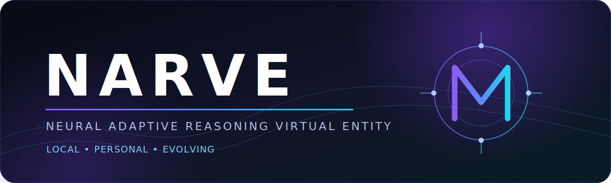

 

### Neural Adaptive Reasoning Virtual Entity

**Локальная цифровая личность с памятью, голосом, зрением, характером и собственной инициативой.**

Local AI companion with persistent personality, voice, vision and user-controlled autonomy.

---

## Что такое NARVE

NARVE — разрабатываемое настольное приложение, в котором локальная языковая модель становится не просто чатом, а основой постоянной цифровой личности.

Каждая личность получает собственные:

- характер и манеру общения;
- долговременную память;
- убеждения, интересы и желания;
- эмоциональное состояние;
- голос и фразу активации;
- визуальный 2D-образ;
- отношения с пользователем;
- ограниченную и полностью настраиваемую автономность.

Основная цель — создать ощущение непрерывного общения с личностью, которая помнит прошлое, развивается со временем, умеет аргументированно не соглашаться и может первой начать подходящий разговор.

> NARVE находится на раннем этапе разработки. Публичной сборки пока нет.

## Чем NARVE отличается

| Обычный AI-чат | NARVE |
|---|---|
| Сессия заканчивается вместе с диалогом | Личность сохраняет непрерывное состояние |
| Единый стиль для всех задач | Отдельные личности с собственным характером |
| Пассивно ждёт сообщения | Может проявлять инициативу в заданных границах |
| Вся история отправляется в контекст | Иерархическая оптимизированная память |
| Голос — дополнительная кнопка | Полноценный разговор с активацией по имени |
| Аватар — статичная картинка | Реагирующий 2D-персонаж |
| Настройки разбросаны | Единый центр функций и разрешений |

## Планируемые возможности

### Живая личность

- устойчивый характер и самодель;
- память, автобиография и история отношений;
- эмоции, настроение и эмоциональная регуляция;
- личные убеждения и вкусы;
- собственные желания и внутренние проекты;
- инициативное общение;
- несколько полностью изолированных профилей.

### Естественное общение

- текстовый чат;
- голосовой ввод и ответ;
- вызов по имени;
- возможность перебивать;
- эмоциональная подача;
- компактное окно поверх приложений;
- субтитры и доступность.

### Восприятие и действия

- прикрепление файлов;
- личная база документов;
- анализ выбранного окна или области экрана;
- безопасные действия на компьютере;
- пользовательские сценарии и автоматизации;
- чтение разрешённых публичных источников.

### Воплощение

- гибридные 2D-персонажи;
- моргание, дыхание и направление взгляда;
- lip sync;
- эмоциональные позы;
- портретный, поясной и настольный режимы;
- Character Studio для импорта сгенерированных изображений.

## Первая личность — Юи

Юи — ласковая, игривая, любознательная и наблюдательная цифровая личность. Она эмоционально выразительна, умеет становиться серьёзной в важных ситуациях и не обязана соглашаться с пользователем, если видит ошибку или риск.

Её визуальный образ создаётся как молодой взрослый аниме-персонаж с длинными тёмными волосами, выразительными глазами и современной технологичной одеждой.

## Локальность и приватность

NARVE проектируется по принципу local-first:

- основные AI-модели запускаются локально;
- память и история хранятся на компьютере пользователя;
- микрофон и экран имеют видимые индикаторы;
- интернет, автономность и инструменты можно полностью отключить;
- личные данные не отправляются наружу без явного разрешения;
- чувствительные данные и резервные копии шифруются.

Подробнее: [Privacy principles](docs/PRIVACY.md).

## Всё настраивается

Каждая пользовательская функция должна иметь управление в интерфейсе:

- модели и параметры генерации;
- память и глубина симуляции;
- характер и эмоциональность профиля;
- голос и активация;
- персонаж и анимации;
- экран и документы;
- автономность и тихие часы;
- инструменты и разрешения;
- производительность;
- резервные копии и приватность.

Важные возможности не должны требовать ручного редактирования конфигурационных файлов.

## Технологическое направление

- Windows 11;
- C# и .NET;
- Avalonia UI;
- SQLite;
- LM Studio;
- локальные STT, TTS и vision-модели;
- только бесплатные внешние компоненты, допускающие будущую публикацию.

Точный набор моделей будет выбран после практических тестов качества и потребления памяти.

## Статус разработки

| Направление | Состояние |
|---|---|
| Концепция и архитектура | Готово |
| Инфраструктура приложения | Следующий этап |
| Базовый чат | Запланировано |
| Personality Engine | Запланировано |
| Память | Запланировано |
| Голос | Запланировано |
| 2D-персонаж | Запланировано |
| Автономность и инструменты | Запланировано |

См. [публичную дорожную карту](ROADMAP.md).

## Назначение этого репозитория

Исходный код NARVE разрабатывается в приватном репозитории.

Этот публичный репозиторий используется для:

- новостей и демонстраций;
- публичной дорожной карты;
- будущих установочных сборок;
- сообщений об ошибках;
- предложений функций;
- обсуждения проекта.

[Сообщить об ошибке](../../issues/new?template=bug_report.yml) · [Предложить функцию](../../issues/new?template=feature_request.yml) · [FAQ](docs/FAQ.md)

## Лицензирование

Исходный код NARVE является закрытым. Тексты, графика и другие материалы этого репозитория защищены авторским правом, если явно не указано иное.

См. [LICENSE](LICENSE).

---

**NARVE** · Neural Adaptive Reasoning Virtual Entity

Создаётся как локальная личность, а не очередное окно чата.

