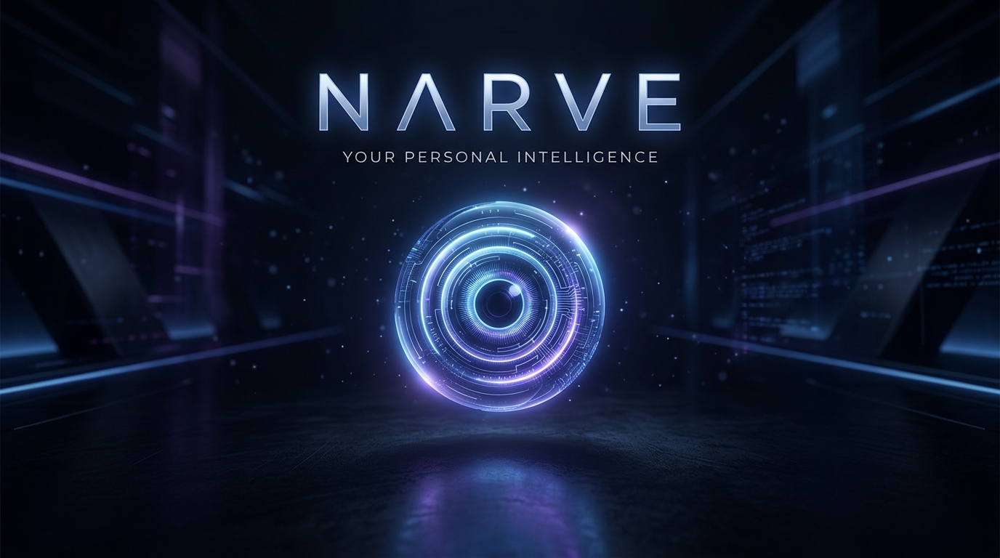

**NARVE — ваш личный, невероятно умный виртуальный помощник. Без облаков. Без подписок. Только вы и ваш ИИ.**

---

## 🌟 Что такое NARVE?

Устали от шаблонных голосовых ассистентов? Боитесь, что корпорации читают ваши личные чаты с нейросетями? 

**Знакомьтесь, NARVE.** Это интеллектуальная сущность нового поколения, которая устанавливается прямо на ваш домашний компьютер. NARVE работает **полностью офлайн** (без подключения к интернету), гарантируя абсолютную конфиденциальность всех ваших данных.

### 🧠 Свой характер и мнение
NARVE — не просто бездушный робот. У неё есть настраиваемый характер, свои интересы и настроение. Она может поспорить с вами, отказаться выполнять абсурдную просьбу или написать вам первой, если ей захочется что-то обсудить.

### 💾 ИИ, который вас помнит
Вам больше не нужно каждый раз объяснять всё с нуля. NARVE обладает долговременной памятью. Она запоминает ваши предпочтения, проекты и привычки, постоянно обучаясь и "размышляя" в фоновом режиме.

### 👁️ Видит, слышит, говорит
NARVE не ограничивается текстом. Она может видеть то, что происходит на вашем экране, и общается с вами живым, эмоциональным голосом. Ваш опыт взаимодействия становится по-настоящему человечным.

### 🛡️ Абсолютная приватность
Все ваши мысли, файлы, голосовые записи и переписки никогда не покидают ваш жесткий диск. Вам не нужна подписка на сторонние облачные сервисы — вы используете мощь только своего компьютера.

## 🚀 Как попробовать?

Продукт находится в стадии **активной закрытой разработки (Closed Alpha)**. Мы усердно трудимся над тем, чтобы сделать NARVE идеальной перед первым публичным релизом.

Добавьте эту страницу в закладки! Как только мы будем готовы, здесь появится кнопка для скачивания удобного установщика для Windows.

---

## Лицензирование

Исходный код NARVE является закрытым. Тексты, графика и другие материалы этого репозитория защищены авторским правом, если явно не указано иное.

NARVE является будущим коммерческим продуктом.

См. [LICENSE](LICENSE).
