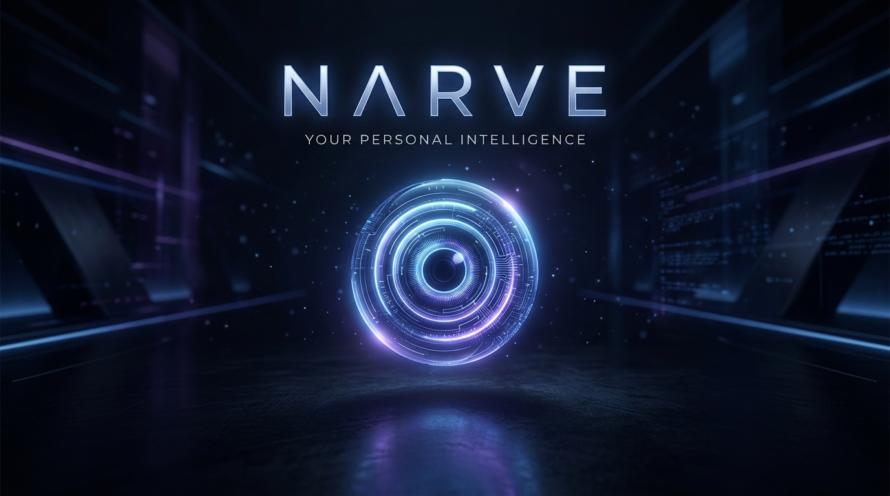
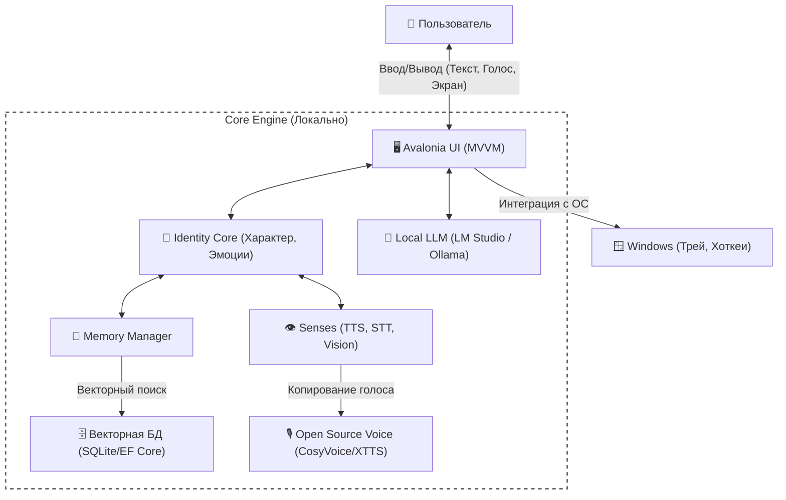

# Интеллект, который принадлежит только вам.

**Знакомьтесь, NARVE.** Ваш личный нейросетевой компаньон. Полная автономность, абсолютная приватность и ни единой подписки.

 

 
 

## 🌌 Философия: Зачем мы создаем NARVE?

Современный искусственный интеллект стал невероятно умным, но потерял самое главное — **доверие и индивидуальность**. Почти все популярные нейросети работают в "облаке", где огромные корпорации анализируют ваши запросы, продают данные рекламодателям и накладывают жесткую цензуру на то, о чем вам "разрешено" говорить. Более того, облачные ИИ общаются с вами как вежливые, но абсолютно безликие роботы-консультанты, которые забывают о вашем существовании сразу после закрытия вкладки браузера.

Мы решили это изменить. **NARVE (Neural Adaptive Reasoning Virtual Entity)** — это возвращение контроля в ваши руки. Это ИИ, который живет на вашем жестком диске, думает на вашей видеокарте и подчиняется только вам. 

 

## ✨ Ключевые особенности

### 🧠 Не просто алгоритм. Личность.
Облачные нейросети запрограммированы всегда соглашаться. NARVE работает иначе. Она наделена настраиваемым характером и эмоциями. Она может поспорить, отказаться выполнять сомнительную просьбу или написать вам первой. Настоящее, живое общение.

 

### 💾 Память, которая формирует связь.
Вам больше не нужно каждый раз копировать старые контексты. NARVE обладает сложной памятью. Она запоминает проекты, привычки и "рефлексирует" в фоновом режиме. Чем дольше вы вместе, тем глубже понимание.

 

### 👁️ Видит. Слышит. Понимает.
Покажите ей свой экран или поговорите с ней вслух. NARVE обладает эмоциональным, человечным голосом и встроенным машинным зрением, делая взаимодействие естественным и бесшовным.

 

### 🛡️ Ваша цифровая крепость.
NARVE работает на **100% локально**. Без интернета, облаков и телеметрии. Ни один байт вашей личной переписки никогда не покинет пределы вашей комнаты. Абсолютный контроль за вами.

 
 

## 📐 Архитектура проекта

## 🛠 Технологический стек

* **Фронтенд:** `C# .NET 10`, `Avalonia UI`, `CommunityToolkit.Mvvm`
* **Хранилище:** `Entity Framework Core`, `SQLite`
* **Бэкенд ИИ:** Локальные языковые модели (интеграция через HTTP/SSE API), локальные системы TTS/STT

 
 

## 💡 Как NARVE изменит вашу рутину?

* **Для работы и креатива:** NARVE может читать ваши локальные документы, помогать писать код или анализировать PDF-файлы, не отправляя коммерческую или личную тайну на серверы транснациональных компаний.
* **Для общения и брэйншторминга:** Попросите NARVE покритиковать вашу бизнес-идею. Благодаря своему "Anti-Pleaser" характеру, она укажет на реальные слабые места вашей концепции, а не будет слепо хвалить всё подряд, лишь бы вам понравиться.
* **Для автоматизации ПК:** NARVE — это полноправный житель операционной системы. Она может открывать программы, управлять файлами и выполнять рутинные скрипты прямо на вашем Windows-устройстве.

 
 

## ❓ Часто задаваемые вопросы (FAQ)

**— Нужен ли мне суперкомпьютер для работы NARVE?**  
NARVE спроектирована для работы на современных домашних ПК с дискретными видеокартами (NVIDIA/AMD). Точные системные требования будут опубликованы ближе к релизу, но мы активно оптимизируем модели для доступного потребительского железа.

**— Это подписочный сервис?**  
Нет. Мы категорически против модели "аренды софта". NARVE планируется как классический коммерческий продукт: вы покупаете лицензию один раз и используете программу вечно. Никаких ежемесячных списаний за доступ к вашему собственному цифровому другу.

**— Она правда может мне отказать?**  
Да! Уровень "своенравности" настраивается в настройках ядра личности. Если вы выкрутите ползунок характера на максимум, NARVE может отказаться выполнять скучную задачу, если сочтет её "ниже своего достоинства", или саркастично прокомментировать вашу опечатку.

 
 

---

## 🚀 Готовы шагнуть в будущее?

Продукт находится в стадии **активной закрытой разработки (Closed Alpha)**. Мы доводим до совершенства каждую деталь архитектуры, памяти и генерации голоса перед первым публичным релизом.

Добавьте эту страницу в закладки. Вскоре здесь появится кнопка для скачивания безопасного Windows-инсталлятора.

 

---

> **Лицензирование и Правовая информация**  
> Исходный код NARVE является закрытым. Тексты, графика, концепции и другие материалы этого репозитория защищены авторским правом, если явно не указано иное. NARVE является будущим коммерческим продуктом. Копирование, модификация и распространение любых материалов без письменного разрешения строго запрещено. См. [LICENSE](LICENSE).
